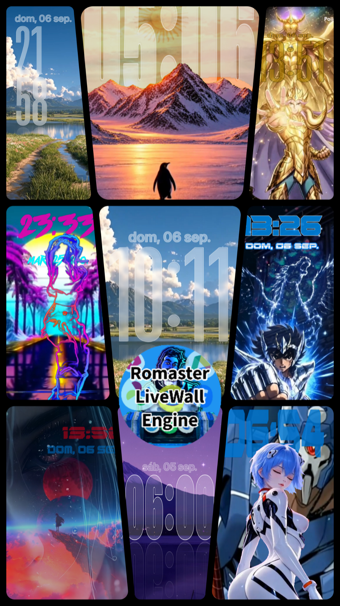
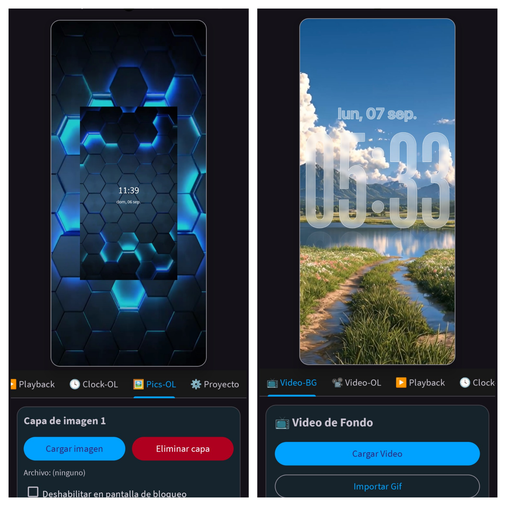
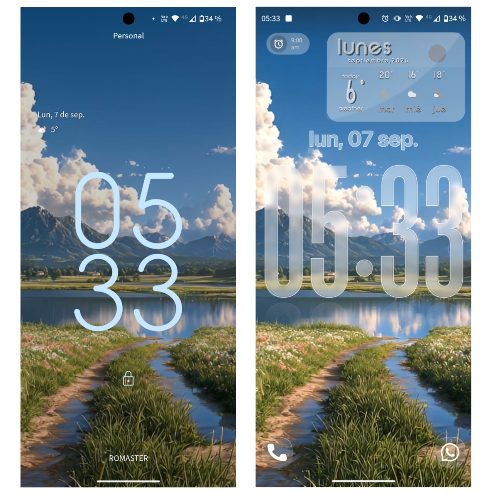
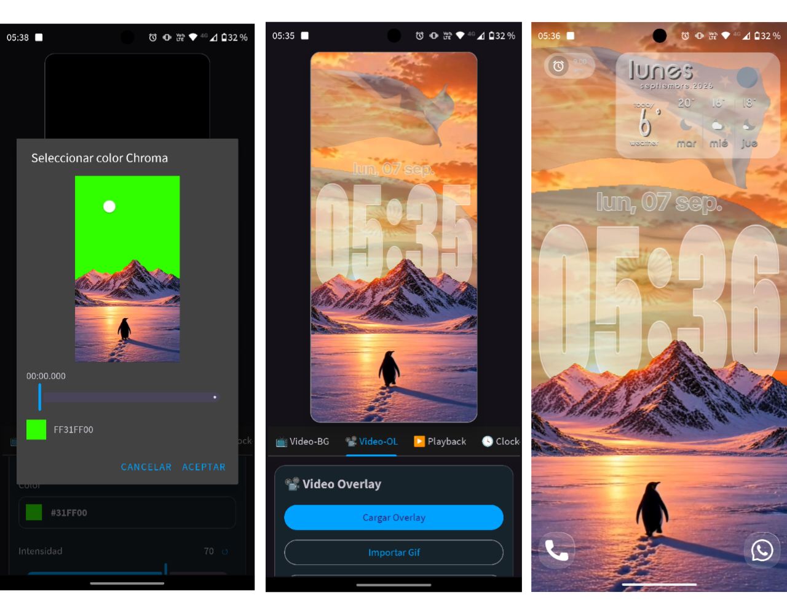
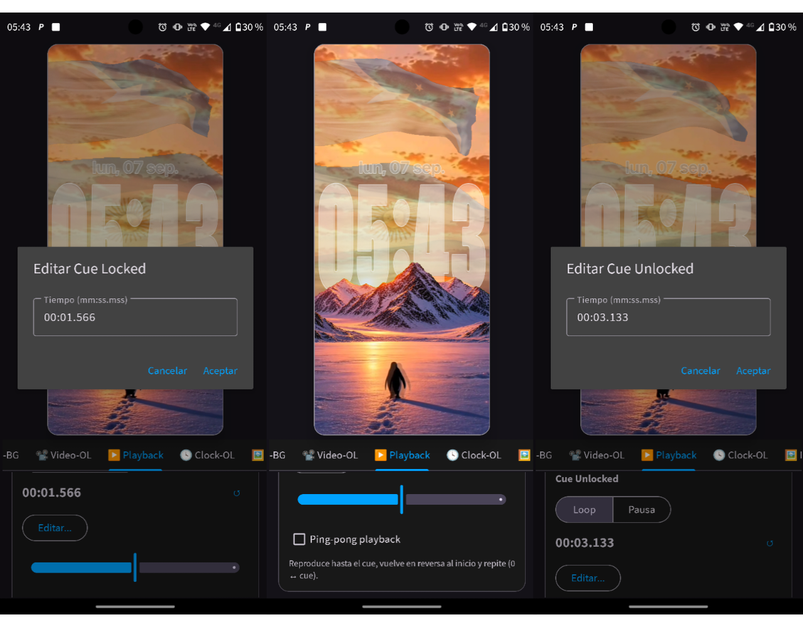
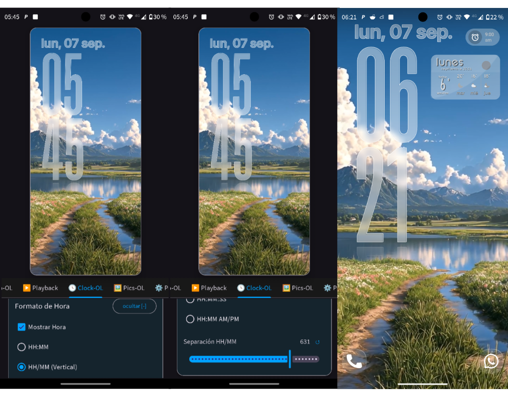
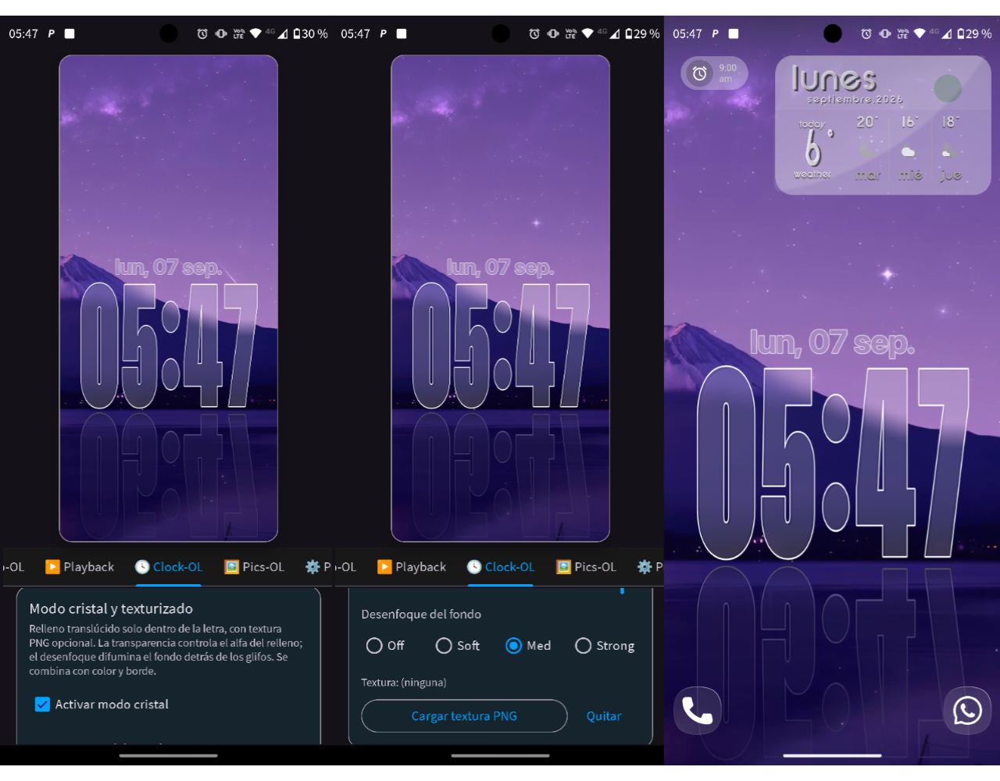
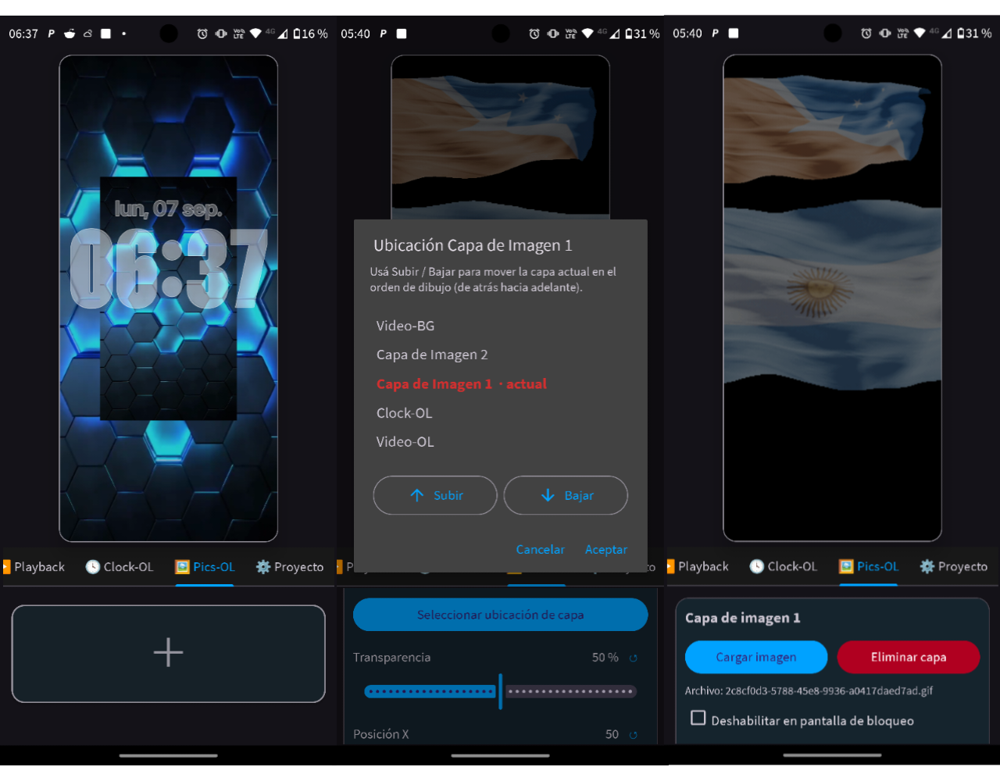
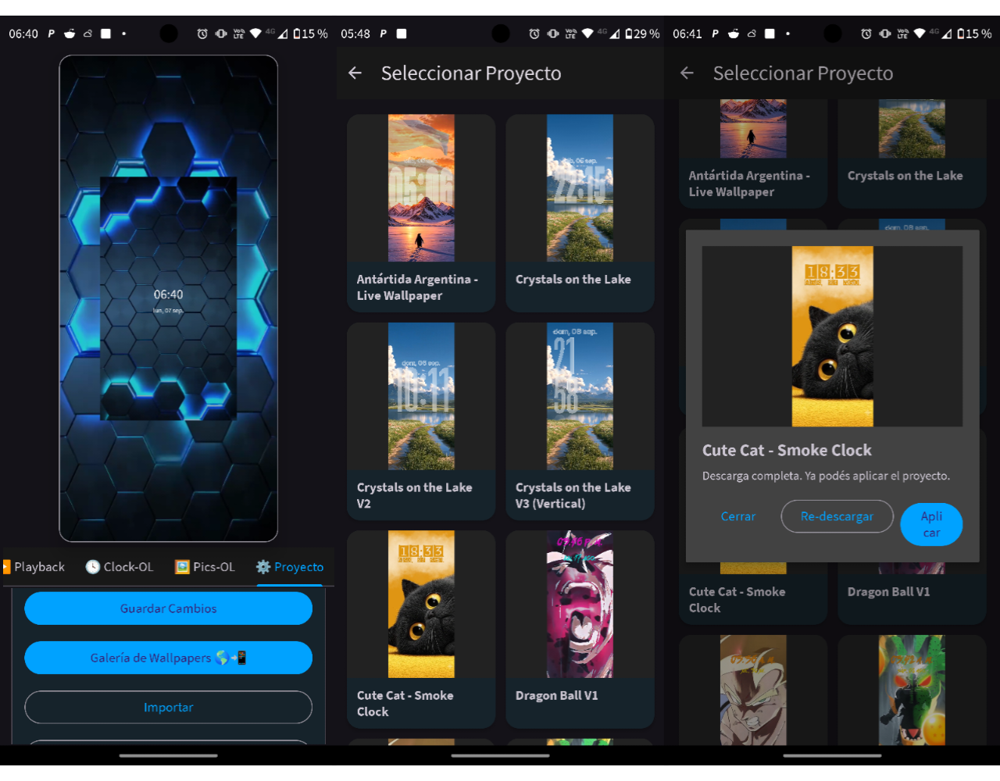
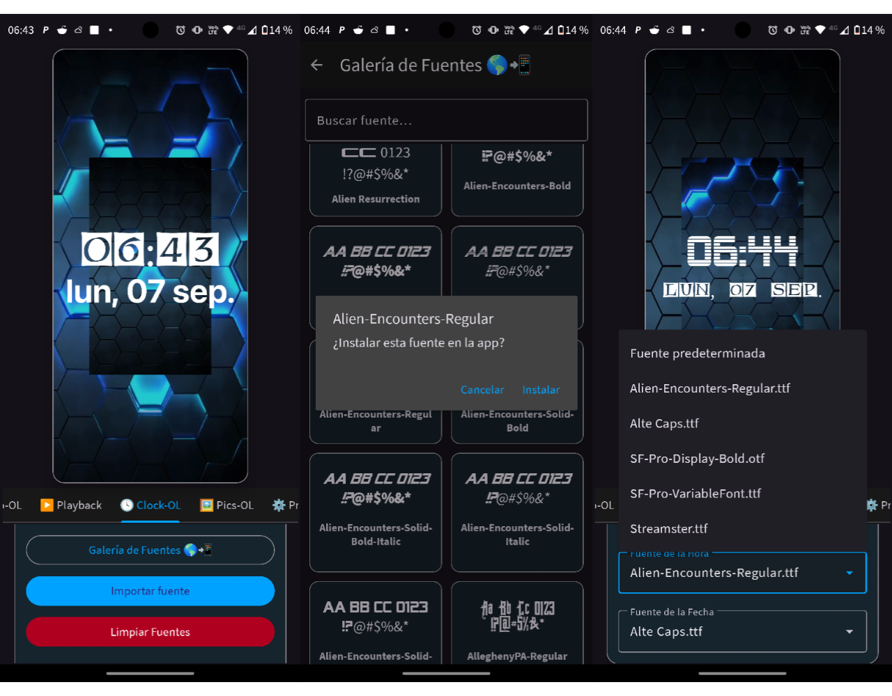

# Romaster LiveWall Engine

<p align="center">
  
</p>

**Motor y editor de live wallpapers para Android** con video de fondo, video overlay, capas de imagen, reloj avanzado (cristal, reflejo, fuentes variables), reproducción reactiva al bloqueo, galerías online y proyectos importables/exportables.

> Crea fondos animados con varias capas, chroma key, audio independiente, ping-pong, soft start y comportamientos distintos cuando el teléfono está bloqueado o desbloqueado.

<p align="center">
  
  &nbsp;
  
</p>

---

## Características

### Capas de composición (OpenGL ES 2)

| Capa | Descripción |
|------|-------------|
| **Video de fondo (Video-BG)** | Video principal a pantalla completa. Stretch / Fit / Fill / Free, escala, posición, audio. Importar **video**, **GIF** (→ MP4) o **pantalla negra**; reset a valores de fábrica. |
| **Video overlay (Video-OL)** | Segunda capa de video: posición, escala, rotación, opacidad, **chroma key**, audio, opción de ocultar en pantalla de bloqueo. Mismas opciones de carga/GIF/negro/reset. |
| **Reloj / fecha (Clock-OL)** | Reloj y fecha con tipografías (fijas y **variables**), colores, bordes, formatos (incluido **HH/MM vertical**), cristal, textura, reflejo, relieve, desenfoque de fondo y soft start. |
| **Imágenes (Pics-OL)** | Capas de imagen/GIF independientes: transparencia, posición, zoom, rotación, orden Z respecto a Video-BG, Video-OL y Clock-OL, soft start y visibilidad en lock screen. |

<p align="center">
  
</p>

### Reproducción reactiva (Playback)

El **Overlay Loop Inteligente** permite que el video overlay se comporte distinto según el estado del dispositivo:

- **Cue Locked** — punto de tiempo y modo (LOOP / PAUSE) al **bloquear**
- **Cue Unlocked** — punto de tiempo y modo al **desbloquear**
- **Ping-Pong** — ida y vuelta fluida con clip de reversa preprocesado (exportable en el ZIP)
- **Soft Start** — fade-in configurable al volver a ser visible (video BG, OL, reloj, cada capa de imagen)
- **Delay Start** — retrasos por módulo; con desenfoque del reloj, el reloj espera a que el resto termine su soft start
- **Simulación de bloqueo** en el editor (mismo comportamiento que el dispositivo real)

Ideal para personajes o escenas que “duermen” en la pantalla de bloqueo y “despiertan” al desbloquear.

<p align="center">
  
</p>

### Reloj avanzado (Clock-OL)

- Formatos de hora: `HH:MM`, **`HH/MM (Vertical)`** con separación ajustable, `HH:MM:SS`, `HH:MM AM/PM`
- Formatos de fecha, intercambiar hora/fecha, superposición y alineación
- **Fuentes** locales + **Galería de Fuentes** (repo de temas) + limpiar fuentes no usadas
- **Fuentes variables** (Roboto Flex, SF Pro variables, etc.): weight, width, optical size, grade y ejes extendidos (GRAD, XOPQ, XTRA, YOPQ, …)
- Tamaños hasta 1000, deformación vertical, colores con alfa, **bordes** solo hacia afuera
- **Modo cristal** + textura PNG dentro del glifo
- **Reflejo** (intensidad, separación, cantidad de degradado)
- **Relieve** de luz
- **Desenfoque de fondo** dentro de los glifos (Off / Soft / Med / Strong), procesado en segundo plano
- Soft start y “habilitar en pantalla de bloqueo”
- Cards expandibles (mostrar [+] / ocultar [-])

<p align="center">
  
  &nbsp;
  
</p>

### Capas de imagen (Pics-OL)

- Añadir capas con el botón **+**
- Carga de PNG, JPEG, WebP, GIF, etc.
- Transparencia, X/Y, zoom, rotación
- Orden de apilado respecto a Video-BG, Video-OL, Clock-OL y otras imágenes (diálogo subir/bajar)
- Soft start y “Deshabilitar en pantalla de bloqueo”
- Reset de sliders a valores por defecto

<p align="center">
  
</p>

### Audio

- Audio del propio video o **pista externa** por capa (fondo y overlay)
- Volumen independiente y mute

### Proyectos y galerías

- **Guardar** configuración actual
- **Importar / Exportar** ZIP (`project.json` + videos + reversas + audio + fuentes + imágenes + preview)
- **Nuevo proyecto** (factory reset)
- **Galería de Wallpapers** — previews desde el repo de temas; descargar y aplicar
- **Galería de Fuentes** — tipografías online con preview y filtro por nombre
- Videos de reversa (ping-pong) incluidos en export/import
- Rectificado opcional de videos al importar (MP4 ligero, bucles más suaves)
- Importar **GIF → MP4** (opción de relleno chroma para transparencias)

<p align="center">
  
  &nbsp;
  
</p>

### Preview en vivo y splash

- Preview OpenGL del **mismo motor** que el live wallpaper (métricas alineadas a la pantalla real)
- **Splash screen** al abrir la app (`res/drawable/splash.png`)

---

## Requisitos

| | |
|---|---|
| **minSdk** | 26 (Android 8.0) |
| **targetSdk** | 36 |
| **Kotlin** | 2.x |
| **Motor gráfico** | OpenGL ES 2.0 + EGL |
| **Video / audio** | AndroidX Media3 (ExoPlayer) + MediaPlayer |

---

## Instalación (desarrolladores)

```bash
git clone https://github.com/Romaster1985/Romaster-Live-Wallpaper-Engine.git
cd Romaster-Live-Wallpaper-Engine
./gradlew assembleDebug
```

Abre el proyecto en **Android Studio** (Ladybug o superior) y ejecuta en un dispositivo o emulador con OpenGL ES 2.

**Temas y fuentes públicos** (galerías de la app):

- [Romaster-Live-Wallpaper-Themes](https://github.com/Romaster1985/Romaster-Live-Wallpaper-Themes)

Para usar el live wallpaper:

1. Abre la app y configura video / overlay / reloj / imágenes  
2. Guarda el proyecto  
3. Ajustes del sistema → Fondo de pantalla → Live wallpapers → **Romaster LiveWall Engine (GL)**  

---

## Estructura del código

```
app/src/main/java/com/romaster/livewallengine/
├── MainActivity.kt / SplashActivity.kt
├── model/          # WallpaperProject, capas, clock, cues, formatos
├── project/        # ProjectManager, DefaultProject
├── render/         # GL*, ClockRenderer, shaders, blur, capas de imagen
├── video/          # players, cues, transcoder, GIF→MP4, reverse / ping-pong
├── audio/
├── wallpaper/      # GLWallpaperService (+ Video / Canvas)
├── storage/        # ZIP import/export, directorios
├── gallery/        # ProjectGalleryActivity, FontGalleryActivity
├── ui/             # WallpaperPreviewView, diálogos
├── font/           # FontStorage, FontManager (variables)
└── debug/          # FileLogger
```

### Pestañas del editor

| Tab | Contenido |
|-----|-----------|
| **Video-BG** | Video / GIF / pantalla negra, ajuste, escala, posición, audio, reset de tab |
| **Video-OL** | Overlay, chroma, transformaciones, lock screen, audio, reset de tab |
| **Playback** | Cues, ping-pong, soft start, delay start, simulación de bloqueo |
| **Clock-OL** | Formatos, fuentes, variables, cristal, reflejo, blur, posición, bordes |
| **Pics-OL** | Capas de imagen, orden Z, soft start, lock screen |
| **Proyecto** | Guardar, importar, exportar, nuevo, galería de wallpapers |

---

## Formato de proyecto (ZIP)

```
proyecto.zip
├── project.json       # Capas, cues, clock, fades, ping-pong, imágenes…
├── preview.png        # Miniatura del diseño
├── videos/            # wallpaper_video, overlay_video, reversas
├── audio/             # Pistas externas (opcional)
├── fonts/             # Tipografías del reloj (opcional)
└── images/            # Capas Pics-OL (opcional)
```

---

## Servicios de wallpaper

| Servicio | Uso |
|----------|-----|
| **GLWallpaperService** | Motor completo OpenGL (**recomendado**) |
| **VideoWallpaperService** | Variante más simple basada en video |
| **CanvasWallpaperService** | Variante Canvas 2D |

---

## Stack técnico

- **Kotlin** + AndroidX (AppCompat, Material 3)  
- **OpenGL ES 2** (EGL, texturas OES, shaders de video, croma y cristal)  
- **Media3 ExoPlayer** + MediaPlayer  
- **Kotlinx Serialization** (`project.json`)  
- **ColorPickerView** (Skydoves)  
- Procesado en segundo plano del reloj (bitmap buffer) y blur de backdrop  
- Ciclo de vida del surface con generaciones de **RenderThread**  

---

## Licencia

Consulta el archivo [LICENSE](LICENSE).

Este proyecto incluye **ColorPickerView** (skydoves) bajo Apache License 2.0.

```
Copyright 2026 Román Ignacio Romero (Romaster)
Licensed under the Apache License 2.0
```

---

## Autor

**Romaster** ([@Romaster1985](https://github.com/Romaster1985))

Ideas, issues y pull requests son bienvenidos.
